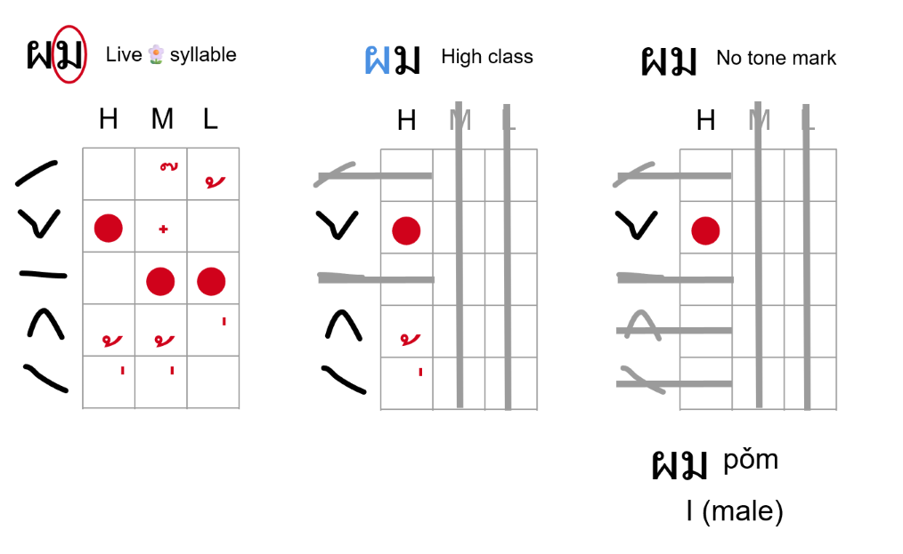
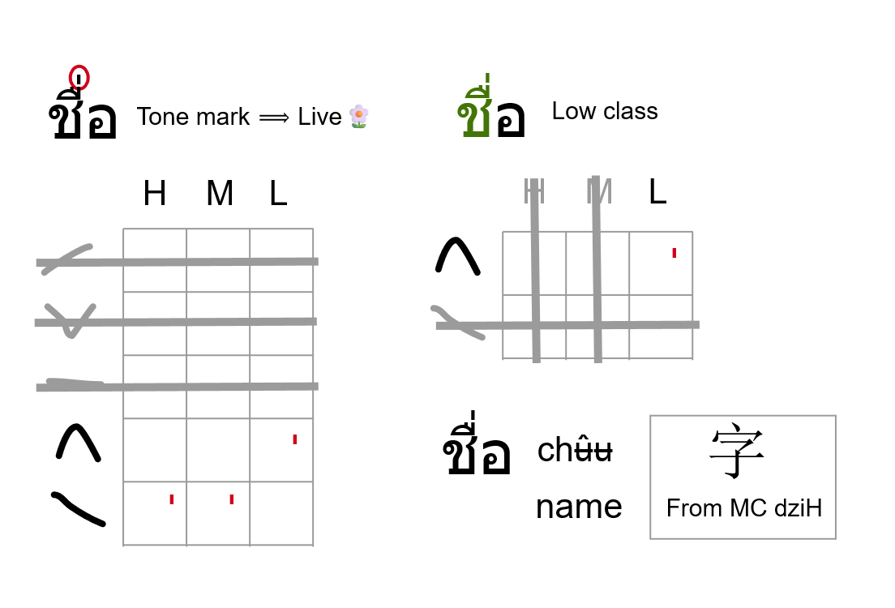
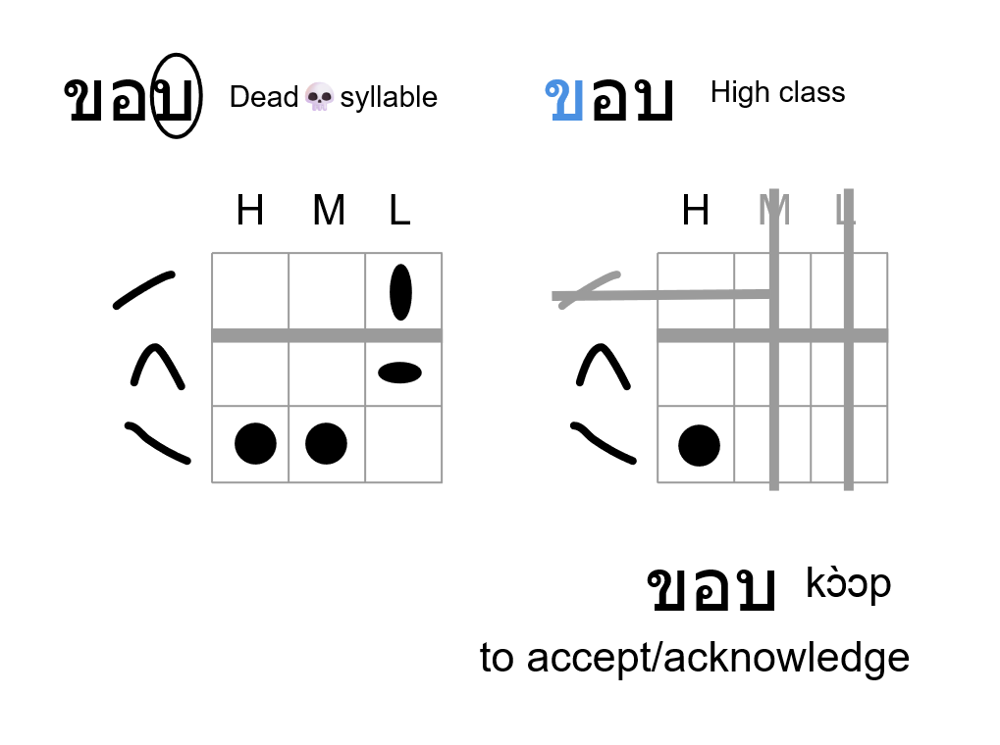
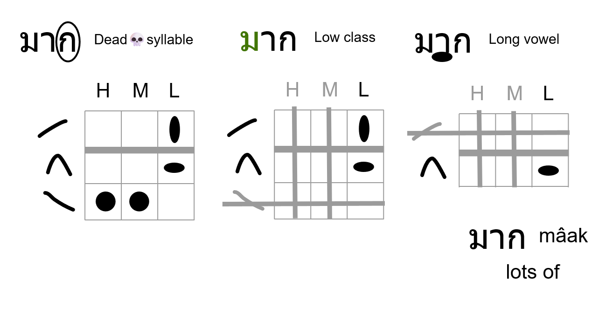

Thai Glyph-to-Tone Procedure
============================

Given a written Thai syllable, how do I determine the tone?

(Taking advantage of my visual shape-rotator memory.)

## 1. Memorise the tone order

It's symmetric top-to-bottom, begins with HIGH at the TOP, the arrows point / pinch towards the  centre.

## 2. Memorise the 5x3 tone grid

My own recolouring of the [Wikipedia diagram](https://en.wikipedia.org/wiki/Thai_script#Tone). Along the vertical are the tones in order; along the horizontal are the High, Medium and Low consonant classes.

Note: because my reference for these classes is the [r18n table](https://r12a.github.io/scripts/thai/th.html#consonants), which is goes Hi-Mid-Lo, that's the order etched into my visual memory so my tone grid is mirrored from the Wikipedia version.

Everything related to LIVE syllables is RED with blood, while DEAD syllables are BLACK as intergalactic space. Since a syllable is either live or dead, only one of these layers will be in use:

In particular, notice how the tone marks are for live syllables only. If you see one, it's live. If you don't see one, it could be live or dead. Also notice that some of the combinations are impossible.

## 3. Use each feature you notice to narrow down the possibilities

E.g. I notice a tone mark, so I use the live grid layer. I see which tone mark it is, so I eliminate the irrelevant rows. Now I just need to plug in the class of the consonant.

E.g. I notice a final stop, so it's dead, so I use the dead grid layer. I see the consonant is low class, leaving two possibilities based on the vowel length.

## 4. Profit

### Live examples

### Dead examples

